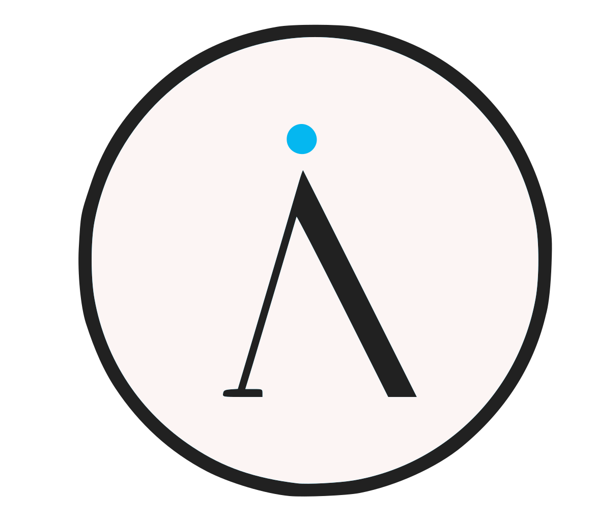

<!DOCTYPE html>
<html lang="en">
<head>
    <meta charset="UTF-8">
    <meta name="viewport" content="width=device-width, initial-scale=1.0">
    <title>Better Advert player</title>
    
</head>
<body>
    

        

            Better Advert Player
            <button onclick="closeApp()">-</button>
        

        

        <button id="playNextButton" onclick="playNextVideo()">Play Next Video</button>
        <button class="buton" onclick="window.location.href = 'https://advert.randspoon.co.uk/update.html';">Updates!</button>
    

    </img>
    <a href="index.html">downgrade to older version</a>

    
</body>
</html>
